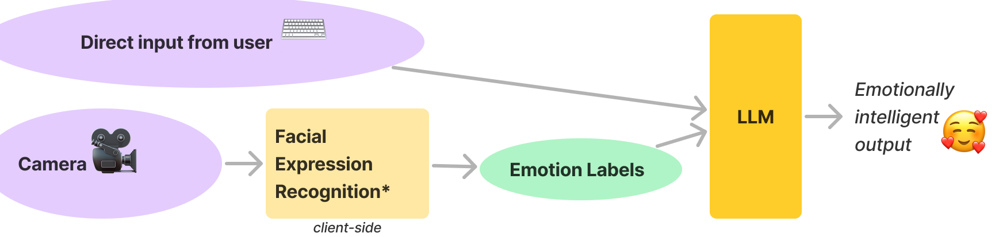

# SPAR Summer 2024: Improving RLHF with Emotion-Based Feedback

Updated 2024-06-19

# EMILI (Emotionally Intelligent Listener)
videochat.py: Adds emotion tags sourced from video to your OpenAI API calls.



# Real-time emotion visualizer
tunnel.py: Abstract visualization of your facial expressions in real time

Credit: Facial Emotion Recognition classifier by Octavio Arriaga: https://github.com/oarriaga/paz

# Setup instructions

- Install dependencies

```bash
pip install PyQt5 numpy opencv-python openai tenacity pygame
pip install tensorflow==2.15.0
```

(The FER classifier was trained with an older version of Keras, which is why we force tensorflow version 2.15.0. This is kludgy and we should find a more elegant way, but it doesn’t matter much because we’re not training the FER classifier, just using it black box.)

- Test out the emotion visualizer!

```bash
python3 tunnel.py
```

It should open a GUI with 2 tabs, one shows the camera feed with boxes around any faces detected, the other shows a color-coded “tunnel” of the real-time emotions detected.

-Troubleshooting: if the camera doesn’t open, try listing available cameras:

```bash
python3 camera-check.py
```

tunnel.py opens camera ‘0’ by default, which is usually the laptop camera on a mac, but to force a different camera, you can use the camera_id flag:

```bash
python3 tunnel.py --camera_id 1
```

- Make faces and experiment with the FER classifier and visualizer! It works well in most  situations but not if backlit.

- Test out the video chat! You’ll need an OpenAI API key.

```bash
python3 videochat.py
```

It should open a GUI with 3 tabs: chat, FER, and transcript. Use the bottom of the chat tab to chat with GPT-4, press enter to send. 

- You’ll notice that Emili chats with you unprompted sometimes. That’s because every so often she sees a snapshot from the camera. Also, when your emotions change, she sees a summary of the recent emotion data. You can see exactly what gets sent in the “transcript” tab.

- Have fun!