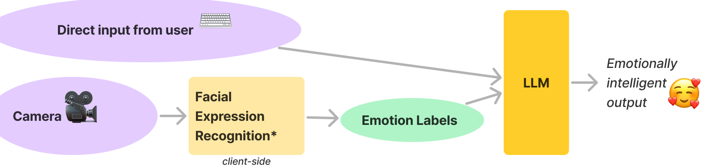

# EMILI (Emotionally Intelligent Listener)
videochat.py: Adds emotion tags sourced from video to your OpenAI API calls.



# Real-time emotion visualizer
tunnel.py: Abstract visualization of your facial expressions in real time

Credit: Facial Emotion Recognition classifier by Octavio Arriaga: https://github.com/oarriaga/paz, updated Facial Emotion classifier: https://huggingface.co/prithivMLmods/Facial-Emotion-Detection-SigLIP2

# Personalization and chat updates

This project was extended with a full user personalization pipeline for facial emotion recognition (FER), with integration into `videochat.py`.

## Files changed

### `personalization.py`
- Added user personalization workflow:
  - `collect` -> `baseline` -> `finetune` -> `evaluate` (or `all`)
- Collected user-labeled webcam frames for:
  - `angry, happy, neutral, sad, surprised`
- Saved metadata per frame (`user_id`, timestamp, label, split, etc.)
- Ran baseline evaluation before training
- Split data 80/20 train/val
- Fine-tuned SigLIP2 FER model on user data
- Evaluated personalized model and wrote metrics
- Added intensity calculations

### `prompts_personalization.json` 
- Created prompt set for data collection
- Current setup:
  - 5 intensity levels each for `happy`, `sad`, `angry`, `surprised`
  - 1 neutral prompt (neutral has no intensity scale)

### `emili_core.py`
- Switched FER runtime to SigLIP2
- Display clearer overlay labels:
  - dominant emotion
  - confidence
  - intensity (`N/A` for neutral)

### `videochat.py`
- Added `--user_id` and personalized model loading
- Automatically loads per-user artifacts from:
  - `data/personalization/<user_id>/models/`
- Updated default chat model settings to mini GPT-5.4 variants

## Data and artifact layout

All personalization artifacts are saved under:

```text
data/personalization/<user_id>/
  frames/
  metadata/
  models/
  reports/
```

## Personalization workflow

Run full pipeline:

```bash
python personalization.py --user_id <user_id> --mode all
```

Run stages separately:

```bash
python personalization.py --user_id <user_id> --mode collect
python personalization.py --user_id <user_id> --mode baseline
python personalization.py --user_id <user_id> --mode finetune
python personalization.py --user_id <user_id> --mode evaluate
```

Run chat with personalized FER:

```bash
python videochat.py --user_id <user_id>
```

## Intensity vs confidence (runtime)

- **Confidence**: model certainty for each class (shown as percent-like values)
- **Intensity**: estimated magnitude of non-neutral emotion (shown as `/5`, intensity shown as `N/A`)

# Setup instructions

- Install dependencies

```bash
pip install PyQt5 numpy opencv-python openai tenacity pygame
pip install tensorflow==2.15.0
```

(The FER classifier was trained with an older version of Keras, which is why we force tensorflow version 2.15.0. This is kludgy and we should find a more elegant way, but it doesn’t matter much because we’re not training the FER classifier, just using it black box.)

- Test out the emotion visualizer!

```bash
python3 tunnel.py
```

It should open a GUI with 2 tabs, one shows the camera feed with boxes around any faces detected, the other shows a color-coded “tunnel” of the real-time emotions detected.

-Troubleshooting: if the camera doesn’t open, try listing available cameras:

```bash
python3 camera-check.py
```

tunnel.py opens camera ‘0’ by default, which is usually the laptop camera on a mac, but to force a different camera, you can use the camera_id flag:

```bash
python3 tunnel.py --camera_id 1
```

- Make faces and experiment with the FER classifier and visualizer! It works well in most  situations but not if backlit.

- Test out the video chat! You’ll need an OpenAI API key.

```bash
python3 videochat.py
```

It should open a GUI with 3 tabs: chat, FER, and transcript. Use the bottom of the chat tab to chat with GPT-4, press enter to send. 

- You’ll notice that Emili chats with you unprompted sometimes. That’s because every so often she sees a snapshot from the camera. Also, when your emotions change, she sees a summary of the recent emotion data. You can see exactly what gets sent in the “transcript” tab.

- Have fun!
